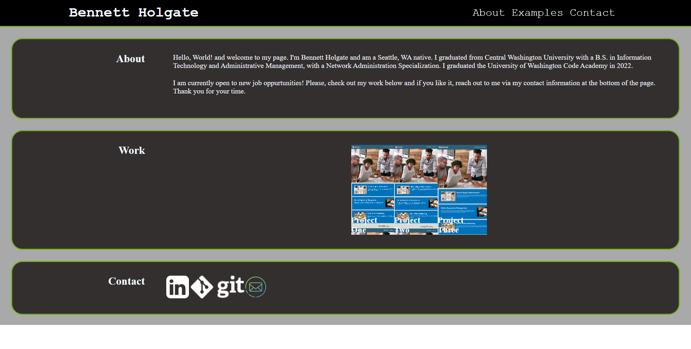

# Accessibility_Project
Week 1 Homework

## Description

This weeks project was to clean up and edit a page for a search engine optimizition company. I have added a title to the page, which was not there before. I added alt text to all the images describing what was shown.

This week I learned how to upload files to Github, add files to a repo, and commit changes, and push the files to Github.

We also learned the importance of using alt tags to define an image for visually challenged individuals.

## Technologies Used

-HTML
-CSS

## Installation

1. Clone this repository to your computer's desktop.
2. Navigate to the top level directory.
3. Open the index.html file in a browser.

## Usage

